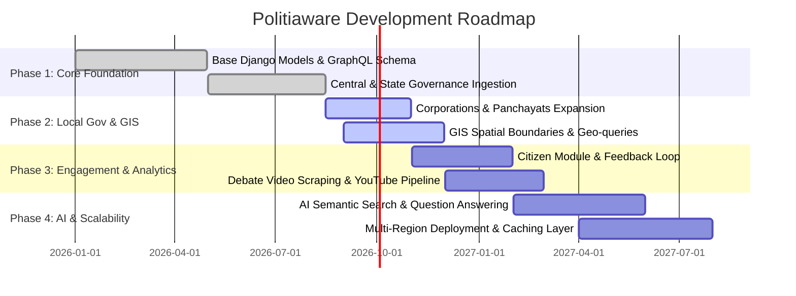

# 🗺️ Politiaware Backend — Product & Technical Roadmap

## 📌 Overview & Vision
**Politiaware (Adhikar)** is an open, comprehensive, and data-driven civic intelligence backend platform. The system aggregates, organizes, and exposes detailed governance, legislative, executive, local administrative, and demographic information across India.

The backend aims to serve as the unified API layer powering citizen-facing web apps, mobile apps, civic researchers, and transparency initiatives.

---

## 🎯 Strategic Pillars

```
+-----------------------------------------------------------------------------------+
|                              Politiaware Strategic Pillars                        |
+---------------------+---------------------+------------------+--------------------+
|  1. Data Integrity  |  2. Multi-Tier      |  3. Geo-Spatial  |  4. Developer-     |
|     & Coverage      |     Governance      |     & GIS Intel  |     First APIs     |
+---------------------+---------------------+------------------+--------------------+
```

1. **Comprehensive Data Coverage**: Structured representation of national, state, and local governance entities.
2. **Multi-Tier Governance Tracking**: Deep integration covering Central (Lok Sabha, Rajya Sabha, President, Vice President), State (Vidhan Sabha, Legislative Council, Governors, Chief Ministers), and Local bodies (Municipal Corporations, Panchayats).
3. **Geo-Spatial & Demographics Integration**: Boundary mapping, GIS shapefiles, constituency-level demographic profiles.
4. **Developer-First APIs**: Unified GraphQL schemas and high-throughput REST APIs.
5. **Transparency & Media Ingestion**: Integration with official session records, debates, and YouTube feeds.

---

## 🚀 Roadmap Phases



---

## 📍 Detailed Milestone Breakdown

### Phase 1: Core Governance & API Foundations (v1.0.0) — *Current*
- [x] **Project Architecture**: Modular Django application structure running under Python 3.14+ with Gunicorn and Nginx.
- [x] **National Executive & Parliament**:
  - Models and APIs for `president`, `vicepresident`, `loksabha`, and `rajyasabha`.
  - Member of Parliament (MP) profiles, political party associations (`party`), tenure records.
- [x] **State Governance**:
  - State legislative assemblies (`assembly`), legislative councils (`council`).
  - Executive roles: Chief Ministers (`cm`), Governors (`governor`), Council of Ministers (`executive_leaders`).
- [x] **Core Person & Political Identity**: Unified `person` entity tracking biographical details, portfolios, and political affiliations.
- [x] **Containerization & Deployment**: Multi-stage Docker, Docker Compose orchestration, automated environment configuration scripts.

---

### Phase 2: Local Administration, Demographics & GIS (v1.1.0 – v1.2.0) — *Q3–Q4 2026*
- [ ] **Local Self-Government (Urban & Rural)**:
  - Full ingestion pipeline for Municipal Corporations (`carporations`) across major urban centres.
  - Gram Panchayat and Zilla Parishad models (`panchayats`) with ward-level hierarchy.
- [ ] **Area & Population Engine (`area_pop`)**:
  - Hierarchical linking: Country → State → District → Sub-district/Taluk → Constituency → Ward/Village.
  - Demographic indicators (Census data, voter population, literacy, sex ratio).
- [ ] **Spatial Data & GIS (`maps`)**:
  - GeoDjango / PostGIS integration for polygon boundary querying (`/readme/gis.md`).
  - Spatial point-in-polygon resolution (Find My Constituency by GPS coordinates).
  - GeoJSON export endpoints for interactive map rendering.

---

### Phase 3: Citizen Engagement & Media Intelligence (v1.3.0 – v1.4.0) — *Q1–Q2 2027*
- [ ] **Citizen Module (`citizen`)**:
  - Authenticated citizen portal backend (JWT / OAuth2).
  - Issue reporting and grievance tracking mapped to elected representatives.
  - Representative rating and accountability metrics.
- [ ] **Session & Debate Monitoring (`session_info`, `youtube`)**:
  - Parliamentary session metadata, bill introduction status, and question hour tracking.
  - Automated YouTube video indexing for Sansad TV and state assembly proceedings.
  - Timestamped video tagging linked to specific politicians and topics.
- [ ] **Automated Data Scraping & Sync Pipelines**:
  - Scheduled scrapers for Election Commission affidavits, Lok Sabha/Rajya Sabha question portals.
  - Celery / Redis asynchronous worker pool for periodic data refresh.

---

### Phase 4: AI/ML Civic Intelligence & Platform Scalability (v2.0.0+) — *H2 2027*
- [ ] **AI-Powered Civic Insights**:
  - Multilingual semantic search across bills, manifesto promises, and parliamentary speeches.
  - Automated summary of legislative bills in regional Indian languages.
- [ ] **Platform Scaling & Resilience**:
  - Redis caching layer for high-volume GraphQL queries.
  - Database read-replicas for analytical and public querying.
  - Public API developer portal with rate limiting, API keys, and comprehensive SDKs.

---

## 🛠️ Technology Evolution Matrix

| Layer | Current Stack | Target / Upgraded Stack |
|---|---|---|
| **Language & Runtime** | Python 3.14 | Python 3.14+ (Async support) |
| **Framework** | Django / DRF / Graphene | Django 5+ / Graphene-Django / Strawberry |
| **Database** | PostgreSQL | PostgreSQL + PostGIS (GeoDjango) |
| **Task Queue** | Shell cron / Bash tasks | Celery + Redis |
| **Web Server** | Nginx + Gunicorn | Nginx + Gunicorn (Uvicorn workers) |
| **Containerization** | Docker Compose | Docker Compose + Kubernetes Helm Charts |
| **Observability** | File logs / stdout | Prometheus + Grafana + Sentry |

---

## 🤝 Feedback & Contributions
Have suggestions for the roadmap? Please create an issue or submit a pull request with proposed enhancements.
